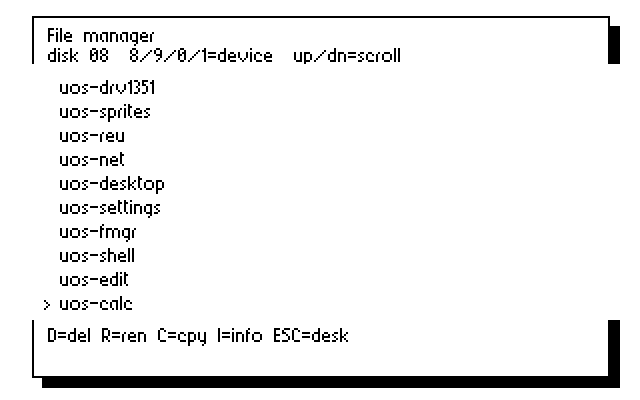

# Storage and loader validation — 2026-09-08

This record covers the storage/loader increment after `f606dd4`. It does not
certify the complete OS, all file types, or all Commodore/Ultimate devices.
The [completion roadmap](../../IMPLEMENTATION-ROADMAP.md) tracks those gates.

## Final build emulator regression

All seven suites passed against the same final build. The runner verified
that the build did not change between suites. The hardware-final PRG hashes
also match this [build manifest and result](emulator/report.json).

| Suite | Evidence |
|---|---|
| x64 storage | [Log](emulator/storage64.log): cache/viewport boundaries, exact bitmap restoration, empty/absent drives, system-device restoration, failed 16-character load |
| x128 storage | [Log](emulator/storage128.log): the same checks plus VDC screen-code readback |
| File manager | [Log](emulator/fm.log): 18 directory/action/settings checks |
| VDC | [Log](emulator/vdc.log): 14 display, input, control-table, clock and timezone checks |
| Cross-device copy | [Log](emulator/copy.log): both 18,439-byte files persist intact; PRG type and existing-destination rejection |
| Editor | [Log](emulator/edit.log): five load/edit/save/exit checks |
| Calculator | [Log](emulator/calc.log): twelve arithmetic/error/edit/exit checks |

Both storage suites retain their initial and round-trip 8,000-byte bitmaps.
The other per-suite temporary disk images and host logs are identified in the
logs; they are reproducible fixtures rather than distribution artifacts.

## Physical C128

The reference C128 with Ultimate II+ passed two runs:

* [Cache-boundary run](hardware-cache/report.json): 83-entry IEC directory,
  traversal through ordinals 10, 64 and 72 and back to zero, exact readback of
  every visible VDC filename/selection marker, byte-identical VIC bitmap after
  the round trip, and live desktop input on exit.
* [Final build run](hardware-final/report.json): file-manager scrolling and
  exact VDC filenames, browse drive 9 then launch the calculator from system
  drive 8 and calculate `1+2=3`, and a failed 16-character app load that preserves
  the loader code and returns to a live desktop. The distributable was left
  running on the C128. Drive B was not remounted or written by these checks.

The full cache run preceded the final system-device and core loader fixes.
Its report therefore has different core/file-manager hashes. The final run
verifies those fixes and the displayed listing on the final build; it does
not repeat the full 83-entry physical traversal. The VDC driver is identical
in both runs. These are separate pieces of evidence, not one interchangeable run.



The PNG is a monochrome rendering of the VIC bitmap read from the physical
machine. The `vdc-*.bin` files are raw 80×25 VDC screen codes. The cache run's
[initial](hardware-cache/initial.png) and
[round-trip](hardware-cache/roundtrip.png) captures are identical.

Timing in the cache report includes host keyboard injection, REST/DMA reads,
readiness polling and painting. It is not an isolated input-latency benchmark.
The total is still too slow for the intended desktop experience; incremental
painting and a measured hardware performance budget remain work to do.

## Reproduction and limits

Build once, then keep PRGs and listings unchanged throughout a test run:

```sh
./build.sh
python3 -u tests/run_ci.py storage64 storage128 fm vdc copy edit calc
python3 -u hw_storage_check.py
python3 -u hw_storage_check.py --quick
```

The hardware commands mount a private fixture or the distributable on drive A
and reboot the reference C128. They require the configured Ultimate REST
connection. The host tools still depend on the local `cbm` helper; a portable
SDK/test installation remains a roadmap requirement.

The cross-device test uses two VICE true-drive 1541s without warp. It copies a
nonlinear 18,439-byte PRG both ways, rejects an existing destination, shuts down
the emulator, extracts both files and compares every byte. That is emulator
copy evidence; a physical cross-drive copy test is still required. SEQ/USR
have implementation but no dedicated integrity fixtures in this run; REL/VLIR
and partial-file cleanup after failed/cancelled copies remain open.

Only the REST API version `0.1` was observed during this work. That is not a
firmware version; no exact cartridge firmware release is certified here.
