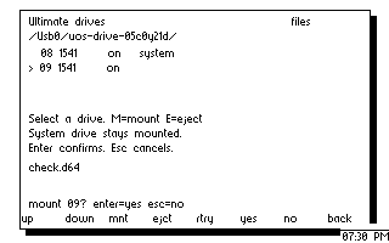

# Ultimate drive panel — 2026-09-08

This change adds drive selection, confirmation and UCI mount/eject to the
desktop browser. It protects the application's load disk, checks fresh drive
identity before each operation, and reconciles the reference cartridge's short
inventory without inventing its missing peripheral records.

The browser PRG is 5,748 bytes including its load address, occupying
`$5000–$6671`. Four name slots move to `$6900–$70ff`, four occupy `$7400–$7bff`,
the path is at `$7100`, and command storage is at `$7c00`. Settings, the CI
trampoline, sprites, screen matrix and resident modules keep their allocations.
Only the browser PRG and distribution image changed from `97e5b04`; all other
production PRGs are byte-identical. [disk.json](disk.json) gives all hashes and
confirms that every one of the 14 PRGs extracted from the D64 matches `target/`.

## CPU, display and emulator evidence

* [cpu.json](cpu.json): ten groups execute the assembled browser and actual UCI
  driver. They cover paging/long names, invalid and absent devices, complete and
  reconciled inventories, independent power queries, unsupported/duplicate IDs,
  system-volume locks including a system disk on IEC 9, changed identities,
  cancellation, mouse selection, firmware errors and complete 514-byte mount
  requests. Guards include settings, command-buffer bounds and the control table.
* [protocol.json](protocol.json): 15 UCI checks, including the command-specific
  empty-status file-read case. The transport continues to return carry clear /
  A=`$ff` for a completed reply without a two-digit status, retaining all data.
* [render/report.json](render/report.json): 32 complete-frame comparisons using
  the actual VIC and VDC drivers. These include mount/eject prompts, cancellation,
  system protection, drive selection and returning to the file list.
* [render-inventory/report.json](render-inventory/report.json): 11 more complete
  comparisons cover four devices, selection through the last row, no devices,
  unknown types, an off drive, invalid replies and return after errors.
* [capture-host.txt](capture-host.txt): the VDC host helper restores all borrowed
  RAM on success, probe failure and a simulated DMA observation error. This
  matters because four filename slots now overlap the capture staging area.
  The 6502 capture probe is unchanged from the
  [nine-case probe validation](../2026-09-08-browser-redraw/README.md).
* [emulator-results.json](emulator-results.json): recorded successful exits for
  storage on x64 and x128 and all 15 VDC/clock/input checks. Storage bitmaps,
  control/capability captures and VICE logs are retained in the matching folders.

Display comparisons include all 8,000 visible VIC bitmap bytes and 4,096 VDC
character/attribute bytes. Cycle counts use modeled immediate VDC readiness
after a required poll; they exclude bad lines, IRQs, DMA and host latency.
They do not certify physical pointer motion or hardware timing.

## Physical C128 + Ultimate II+

[hardware-drives/report.json](hardware-drives/report.json) records a terminal
`HW-DRIVES PASS` on the unchanged build. The reference machine uses IEC 8 for
the system disk and an initially empty IEC 9 for the private fixture. The exact
installed firmware release is unknown. Its Control inventory remains
`04 00 08 01 00 09 01`; the panel reports two reconciled drive records and leaves
the other devices unknown.

The test creates a new private directory and D64 on `/Usb0`, selects it in the
desktop browser, verifies system-drive rejection and cancellation, and confirms
a mount on B. REST readback checks the exact mounted path and unchanged A.
File Manager then loads from A, copies `UOS-SPRITES` to B as `DRIVE-CHECK`, and
lists IEC 9. After browser eject, the cartridge filesystem independently reads
the copied file. The required result is all 129 bytes matching
`2173cffa6a93c533cf900ef29ca84eff1cb7ea4c9e112104b17ab5f84bd5ca14`.
Cleanup restores both DOS paths and the empty B state, deletes only the private
fixture, and leaves the desktop live. Every step passed. Four paired VDC samples
agree on all app cells; each capture verifies restoration of the borrowed RAM.
One capture used one bounded VDC address resynchronization, recorded in its
metadata. There were no RAM-read retries. This is the same address-checked probe
as the preceding validation, not a retry based on expected screen text.

[hardware-browser/report.json](hardware-browser/report.json) records terminal
`HW-ULTIMATE PASS`: a 1,096-entry directory, 32 Next actions through ordinal 256,
complete first/later-page names against an independent packet capture,
Root/Open/Parent, settings preservation and return to the desktop. All seven
paired VDC samples agree, including blank tails and unused rows. Two captures
each used one bounded address resynchronization; every borrowed-RAM restoration
passed, with no RAM-read retries.

Physical selection actions took 0.516–0.649 s. Page actions took
6.463–9.353 s, median 7.9155 s, including host polling. The VIC selection round
trip changed 26 bytes inside the known clock rectangle (X=280–319, Y=184–199)
and none elsewhere. Both bitmaps and the complete difference list are retained;
shared clock/window clipping remains on the toolkit backlog.

Two earlier checks stopped in their readback assertions. Both completed mount,
IEC copy and eject, and both cleaned up successfully:

* [before-volume-filter/report.json](before-volume-filter/report.json): the test
  incorrectly counted a D64 volume-label record (attribute `$08`) as a second
  file. The corrected oracle excludes volume labels and requires exactly the
  `DRIVE-CHECK` file.
* [before-read-status-handling/report.json](before-read-status-handling/report.json):
  the generic numeric-status assertion rejected a successful `READ_DATA` reply
  with empty status. All 129 returned bytes already matched the source;
  [the captured payload](before-read-status-handling/read-empty-status.prg) and
  [reply metadata](before-read-status-handling/read-empty-status.json) are retained.
  `Dos::get_more_data` in the inspected firmware source explicitly uses empty
  status on successful file reads. The test now accepts that form only for this
  read, with no transport error/clipping, exact file contents and successful CLOSE.
  Mount/eject and other commands still require numeric success.

No production code was changed between those hardware runs. These are test
oracle corrections, not evidence of a failed disk copy or mount operation.

## Remaining scope

This is an initial drive integration, not completion of R2 or the OS. The
physical workflow certifies a D64 with two 1541 emulations. G64/D71/G71/D81
compatibility still needs per-model hardware tests. Missing SoftwareIEC/printer
records and external IEC conflicts remain unverified. Mounted-image identity,
power/type/ROM/address controls, write protection, dirty-media handling,
system-disk replacement/recovery, file operations, the native C128 kernel,
full VDC desktop and application parity remain on the
[completion roadmap](../../IMPLEMENTATION-ROADMAP.md).
