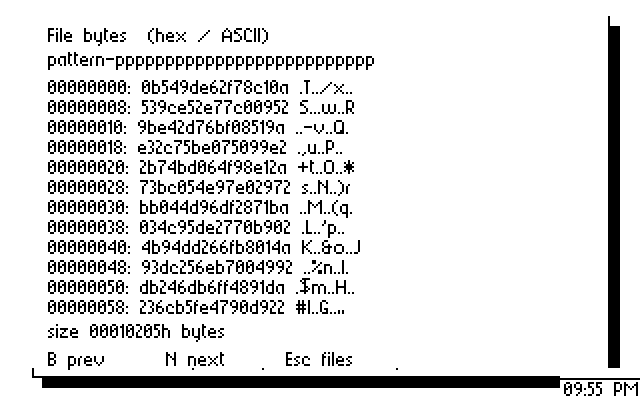

# Shared Ultimate files and desktop viewer — 2026-09-08

The browser now opens a modal hex/ASCII viewer on both displays through a
resident binary file API. The API owns both DOS contexts independently,
supports read/exclusive creation/write/32-bit seek, verifies every write,
and retains uncertain handles for explicit close recovery. Application
replacement and desktop entry attempt to release owned handles.

The new resident allocation is `$4100–$4fff`. File code/state occupies
`$4100–$47c7`, and the viewer occupies `$4800–$4c78`. Its 896-byte command
buffer is `$8080–$83ff`; both existing sprites retain `$8000–$807f`.
The desktop ends at `$4055`, and the browser at `$6725`. Both build scripts
include all 15 modules; the Windows script was reviewed but not executed.
[disk.json](disk.json) records every production hash and byte-for-byte
extraction of all 15 PRGs from a copy of the D64. The source image is unchanged
by that check.

## Physical C128 + Ultimate II+

[hardware-files/report.json](hardware-files/report.json) records a terminal
`HW-FILES PASS` on the final production build. The native client generates a
66,053-byte binary file, closes it, and copies it through both DOS contexts.
Independent raw UCI reads after close/reopen match **every byte** of both
files to the host oracle, SHA-256
`f7b3bdd0b90e566a737be5d51bc052a1de2eeb6ff9f936cfcc64786aad148698`.
The source OPEN command is 321 bytes; the longest directory components are
112 bytes and the filename is 63 bytes.

The desktop launcher opens the browser, whose View action displays exact
96-byte pages. Next, Previous and Esc preserve the full names and selection.
Three pairs of independently captured VDC app areas agree, including every
offset, hex byte, ASCII code and blank row tail. All six captures restore their
borrowed RAM, with zero address resynchronizations. The VIC browser round trip
changes 49 bytes, all inside the known clock rectangle (X=280–319, Y=184–199),
and none elsewhere. All three VIC captures restore their app/cassette scratch.

Cleanup removes this run's two files and three private directories, releases
both handles, restores both DOS paths and settings, verifies resident file
instructions, and leaves the desktop live. There were no RAM-read retries.
The [final drive observation](hardware-files/final-drives.json) shows A on IEC 8
and B on IEC 9 with no image. The separate earlier long-name fixture remains
explicitly outstanding below.

## CPU, display and emulator evidence

* [files.json](files.json): the assembled service and actual UCI transport read
  66,310 binary bytes, copy 66,053 bytes, cross 64 KiB offsets, reject invalid
  buffer/ownership/creation arguments, preserve foreign handles and loader
  filenames, and exercise 16 transfer/metadata/cleanup failures. A separate
  modeled USB sector fault verifies the 511+1 write workaround. Names and
  commands reach the full 893/896-byte transport bounds with guarded memory.
* [viewer.json](viewer.json): 683 pages across 64 KiB, 509-byte raw-name cache
  preservation, mouse open/previous/close, EOF/empty files and error recovery.
  Two round trips execute the actual VIC/VDC drivers and restore complete
  browser frames. This model's long-name support proves transport/cache bounds;
  it does not certify firmware lookup of those components.
* [native-probe.json](native-probe.json): the actual 315-byte hardware client
  generates and copies the independently specified 66,053-byte pattern using
  the resident service, with clock scratch clobbering and handle/tick cleanup.
* [core.json](core.json): 1,024 GETCAP calls cover all 256 IDs, including the
  new file-service ID 6, with preserved Y, zero page, non-stack RAM and D/I.
* [boot-banking.json](boot-banking.json): actual core/REU code accepts IRQ
  injection at 75 points before the initial bitmap DMA. `$36` keeps KERNAL
  vectors visible while BASIC is out; the previous `$35` fails this oracle.
* [vic-capture.txt](vic-capture.txt): actual four-part IRQ bitmap capture and
  host restoration after three injected observation failures. Borrowed app
  and cassette RAM, zero page, banking, stack and resident files are preserved.
* [render/report.json](render/report.json) and
  [render-inventory/report.json](render-inventory/report.json): 32 and 11 whole
  frame comparisons preserve drive-panel and navigation behavior with the
  View action in the title. The only later core change is the boot banking
  byte, outside these rendering paths. The UCI transport is unchanged from its
  [15-check protocol validation](../2026-09-08-ultimate-drives/protocol.json).
* [emulator-results.json](emulator-results.json): tool-recorded successful x64
  and x128 storage exits and all 15 VDC checks, with retained private disk,
  bitmap, capability and VICE-log artifacts. These emulator runs precede the
  final write split; final service and viewer CPU tests cover those changes.

## Firmware findings and retained failures

The exact installed firmware release is unknown (DOS V1.2 / Control V1.1).
The inspected firmware checkout is `a01c04e8267a0d916b7203cb34dcf1127f75981d`.
The [DOS protocol](https://1541u-documentation.readthedocs.io/en/master/uci/ultimate_dos_target.html)
defines FILE_INFO's no-open-handle response as 85 and CLOSE's as 84. The first
physical test used the latter for both. It stopped before creation; the service
now requires 85. [before-info-status-fix](before-info-status-fix/report.json)
retains that failure and the subsequent verified empty-directory cleanup.

[firmware-long-component](firmware-long-component/report.json) records an
attempted 255-byte leaf: CREATE succeeded, FILE_INFO returned 82, and no payload
write was issued. The firmware then could not resolve the file for deletion.
Its raw directory reply contains only a 128-byte name prefix followed by two
other bytes. Full returned-name, prefix and guessed 8.3-name lookups all fail
in [inspection.json](firmware-long-component/inspection.json). The source's
`FileInfo(128)` path walker and unterminated FAT name copy explain this limit.
Creation now rejects every component over 127 bytes before any command.
Read-only transport/cache bounds are retained without changing names.

**Outstanding fixture cleanup:** `/Usb0/uos-files-d03c9eb71227` contains that
empty attempted long-name file. Normal firmware APIs cannot address it.
Removal requires direct access to the USB filesystem from a host; the user
has been asked for an accessible host/mount path. This fixture is not reported
as removed. Later tests use short components and clean up their own directories.

[write-readback-diagnosis](write-readback-diagnosis/failed-0-readback.json)
records a second failure: the first 512-byte WRITE returned success but
read-back verification rejected it. Independent readback after close/reopen
also contains wrong data. Command RAM still contains the exact intended bytes.
The test removed its files and restored the desktop. The preceding failure
and post-cleanup buffers are retained in
[before-write-readback-fix](before-write-readback-fix/report.json).

[usb-write-boundary/report.json](usb-write-boundary/report.json) isolates the
firmware using raw UCI commands, without the file service. A 511-byte write
matches after close/reopen; 512 bytes in one command do not; 511+1 matches all
512 bytes. All three private files and their directory were removed. The
service now splits full blocks and verifies all bytes before success. A failed
prefix/tail is never replayed.

The likely source-level cause is direct FAT sector I/O from the command FIFO:
`dos.cc` passes its I/O-mapped command buffer into FAT, `ff.c` sends full
sectors directly to USB, and `usb_memory_ctrl.vhd` retains only 26 address bits.
The FIFO is above `$04000000`. Sub-sector writes first copy into a RAM cache.
This diagnosis is an inference from the source and observed boundary; the
installed firmware was not rebuilt, modified or reflashed.

Other retained failures: [boot-timeout](boot-timeout/) contains observations
from a probe replaced by the shell and a later boot timeout. The latter had
loaded the resident modules but stopped before VDC preference setup. Its stack
showed an IRQ during REU setup; the independent banking test establishes that
hazard, without claiming it proves the cause of every timeout. A later corrected
cold boot and cleanup succeeded. One concurrent x64 run timed out on desktop
liveness with repeated VSync resets; an isolated run passed. An earlier VDC
test expected the old literal help string `ESC exit`; its
[capture](before-vdc-hint-check/ci_ultimate_offline.png) already displayed the
new valid help. The updated check requires V view and ESC, and all 15 checks pass.

The first successful complete create/copy run then stopped in its viewer
oracle: the host helper had omitted the PETSCII `$60–$7f` screen-code range.
Both retained page captures were correct, including raw backtick `$60` becoming
screen code `$40`. [vdc-code-oracle.json](vdc-code-oracle.json) records comparison
of the corrected helper with all 256 inputs to the actual VDC conversion
routine and all 24 retained hardware viewer rows. The
[failed run](before-vdc-code-oracle-fix/report.json) retains its complete
matching source/copy files and successful fixture/handle cleanup.

The service does not yet provide desktop copy/save dialogs, safe replacement,
rename/delete, a shared IEC backend, native C128 kernel, scheduler, GEOS/Wheels
compatibility or application parity. These remain in the implementation roadmap.
