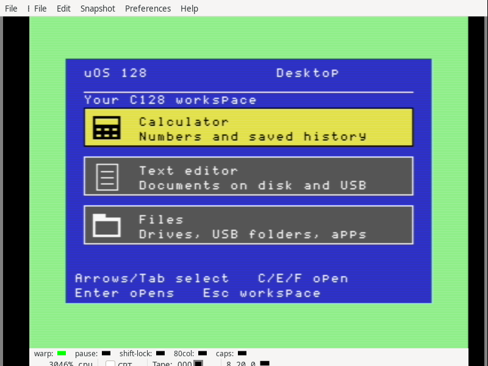

# Native graphical launcher and desktop boot

This private C128 candidate boots a graphical launcher with working Calculator,
Text Editor and Files entries. Arrows and Tab select an entry; Enter opens it;
C/E/F open the corresponding app directly. Escape opens the memory workspace,
where B returns to the desktop. The VDC console displays the same choices and
controls. Files includes the existing native IEC and Ultimate USB navigation.



The [desktop boot disk](source/launcher/desktop-boot.d64) contains the private
ABI 1.8 display kernel. The [workspace boot disk](source/launcher/desktop.d64)
uses the unchanged display candidate and opens the launcher with B. Both stay
in native C128 mode. Neither is a production release or physically qualified.

The desktop PRG is 4,479 bytes, declaring eighteen app pages and reserving a
separate 36-page surface. It leaves 372 of the 426 heap pages free. The existing
dispatcher releases both allocations before loading another app and reloads
the desktop after app exit. The Files variant returns normally to that
dispatcher; the original browser retains its workspace behavior. Rebuilding
the default kernel, browser, calculator, editor, picker and disk produces the
same six images as the pinned display candidate.

Direct desktop boot changes only the successful initialization branch. The
assembled main region ends at `$37f8`, two bytes beyond the preceding candidate;
the low/service regions still end at `$1bf0`/`$4ff9`. It reserves no additional
heap pages. If the desktop file is missing, the workspace reports the load error
and remains able to launch Calculator. A missing selected app returns to the
desktop with an error message. A refused surface reservation or unsupported
display setup leaves both text consoles usable; an allocated surface is freed
when setup fails.

Nine distinct launcher CPU workflows pass on both the workspace and direct-boot
kernels (eighteen executions). They compare whole surfaces and VDC text, check
selection wrap and shortcuts, verify owned handoff and cleanup, display an app
load error, preserve an unrelated allocation, exercise the text fallback and
check the Files return action. The direct-boot kernel also passes five existing
suites: relocation (nine cases), app loading (53), modules (113), display lifetime
(27 groups) and heap/ROM gateways (including fifty boundary transfers).

Five final VICE workflows pass with 16 KiB VDC RAM:

| Boot and configuration | Checked behavior |
|---|---|
| Workspace, 40 columns | Navigation, Calculator result 42, Editor typing and discard cancellation, Files, app returns, blocked-surface fallback and full cleanup |
| Workspace, 80 columns | Missing Calculator recovery, working Files and return |
| Desktop, 40 columns | Complete app workflow and allocation fallback above |
| Desktop, 80 columns | Missing Calculator recovery and Files return |
| Desktop file missing | Usable workspace, Calculator and return |

Independent audits verify 26 complete 9,216-byte surfaces, 1,664,000 actual
rendered pixels, thirty desktop VDC frames, four fallback VIC frames, 29 pairs
of app/workspace consoles, 35 observations and 96 input events. They extract
and compare every system app and kernel from each executed disk and verify
that every final heap is free. VICE's four missing full-canvas tail bytes are
retained; all active desktop pixels were received.

The retained initial CPU failure came from a test helper overwriting the
suspended app's hardware stack while freeing a fixture. The helper now preserves
that stack. The retained first emulator run expected the wrong editor status
after cancelling discard; the editor correctly returned to its normal status.
These failed attempts are excluded from the passing totals.

The package pins the [display](../2026-09-11-native-display-lifetime/README.md)
and [clipping](../2026-09-11-native-graphics-clipping/README.md) archives and adds
45 source/build/report inputs. `emulator/` retains each exact executed harness,
disk and captures. `source/launcher/first-cpu-attempt/` and `history/` retain the
two earlier harness failures. No physical graphics, pointer input, VDC bitmap
desktop, persistent window state or simultaneous apps are claimed. The launcher
starts with Calculator selected after each reload. Ultimate device panels and
the broader desktop/app migration remain on the roadmap.

Read-only audits:

```
python3 verify-package.py
python3 verify-emulator.py
sha256sum --check --quiet SHA256SUMS
```

Both auditors accept `--record` to derive their reports. To reproduce, overlay
the clipping archive's `source/` and then this archive's `source/` on the display
archive's `frozen/`. Run `python3 build-native.py` and `python3 build-launcher.py`.
The CPU launcher check is `tests/ci_native_desktop.py` (requires py65); emulator
checks use `tests/ci_native_desktop_iec.py`, with `--desktop-boot`,
`--missing-calc --80col` and `--desktop-boot --missing-desktop` as applicable.
For the direct-boot CPU checks, copy `launcher/boot/uos128.{prg,lst,sym}` into a
separate copy's `target/native/` before running the retained tests.
