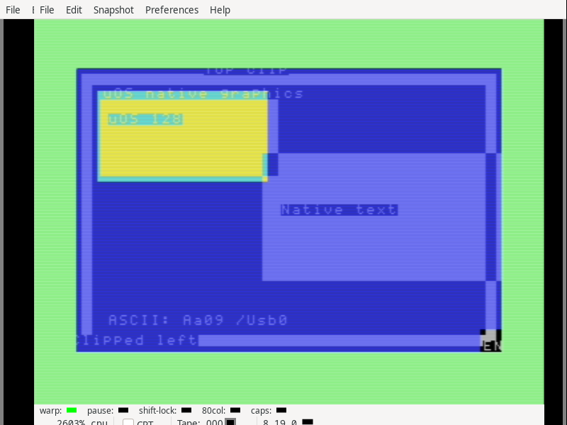

# Native clipped drawing and text prototype

The private native drawing library implements clipped pixel/color rectangles,
8×8 glyphs and bounded ASCII labels through the public owned-heap transfers.
The complete library and its original 95-character font occupy 2,022 bytes.
The 2,886-byte demonstration PRG declares twelve app pages and a separate
36-page VIC bitmap/matrix. This is software qualification on the isolated
ABI 1.8 [display candidate](../2026-09-11-native-display-lifetime/README.md).
The production kernel/app images remain unchanged by this graphics work.

All 607 CPU cases pass against that candidate's real heap services: 173
rectangle cases, 294 glyph cases and 140 text cases, with 12,882 modeled
interrupts. The cases compare complete surfaces in both RAM banks and cover
negative/extreme coordinates, pixel and byte boundaries, all drawing modes,
nonprintable input, ownership failures, busy services and interrupt/decimal
state. The CPU library is loaded inside an eight-page owned allocation.

All five emulator workflows pass with 16 KiB VDC RAM: explicit exit, normal
return, release of a visible surface, missing replacement and text-app
replacement. Three complete 9,216-byte surfaces and five complete 320×200
pixel frames match independent expectations, including seven text labels
clipped at the top, left and right screen edges. Two 513-byte IEC reads occur
while graphics is active. IRQ jiffies advance and both text consoles return
correctly. The retained VICE canvas messages are four bytes shorter than their
declared full canvas; every active pixel used by these comparisons is present.

## Library contract

The source is in [graphics-core.inc](source/graphics/graphics-core.inc) and
[text-core.inc](source/graphics/text-core.inc). Calls are foreground only;
they preserve decimal/interrupt flags and return A/carry plus `gfx_error`.
They borrow `N_BUFFER` and the heap argument mailbox. Keep library state and
the font in the caller's owned bank-0 executable allocation.

* `gfx_bind` takes `N_OWNER` and `N_HANDLE`, validating a 9,216-byte logical
  surface. Either RAM bank is supported for drawing. A failed ownership/extent
  check clears the binding; a busy-service rejection leaves it untouched.
* `gfx_rect` clips signed 16-bit, half-open `x0,y0,x1,y1` bounds to 320×200.
  Pen 0 clears, 1 sets and 2 XORs. Empty/inverted rectangles transfer no bytes.
* `gfx_colors` clips the same coordinates to 40×25 attribute cells, setting
  the foreground/background nibbles from `gfx_color`. Pixel operations leave
  these attributes and bitmap/matrix padding intact.
* `gfx_glyph` draws eight bytes from `gfx_bits` at signed `x0,y0`. Pens 0–2
  affect ink pixels; pen 3 replaces all pixels inside the clipped 8×8 glyph.
  It sets `x1,y1` internally and leaves the origin unchanged.
* `gfx_text` reads up to 64 bytes from its local buffer with an explicit
  length, using fixed 8×8 cells. ASCII 32–126 has distinct glyphs; other bytes
  display `?`. It advances `x0` by eight per byte, saturating at 32,767.

The display candidate separately restricts presentation to an owned bank-0
surface at `$c000..$e3ff`. Drawing to another valid surface does not present it.
These calls do not supply a per-window clip rectangle, input/focus, a pointer,
VDC bitmap rendering, desktop suspension or an app switcher. Drawing throughput,
physical graphics checks and the concurrent large-document/desktop allocation
pattern remain open. The underlying main USB fault remains unresolved; the
graphics results do not qualify that transport.

The largest current rectangle case uses 7,572,884 modeled instructions; the
largest glyph and text cases use 18,331 and 714,388 respectively. These are
CPU instruction counts, not physical elapsed times. Aligned cell transfers
and full-band fills are the next performance work.

## Retained inputs and reproduction

`candidate-context.json` pins the preceding display archive's SHA256 manifest
and its 218 unchanged source/build/harness inputs. `source/` contains the 31
additional source, binary and report files used here. The earlier rectangle-only
experiment remains in its recorded scratch directory; its counts are not added
to the 607 final-library cases above.

`python3 verify-package.py` rebuilds the library, font and demonstration client,
checks every reused/new input and associates the three CPU reports with the
exact library and kernel hashes. `python3 verify-display.py` rebuilds the client
and independently checks raw surfaces, canvas pixels, ownership, IRQ samples,
file-read state and both restored consoles. Both auditors are read-only unless
`--record` is supplied. `sha256sum --check --quiet SHA256SUMS` checks the archive.

To rerun the CPU suites, copy the pinned display archive's `frozen/` directory
to a disposable tree, overlay `source/`, and run `tests/ci_native_graphics.py`,
`tests/ci_native_glyph.py` and `tests/ci_native_graphics_text.py` with Python and
py65 (the retained runs used Python 3.14.7 and py65 1.2.0).
`display-emulator/run.py` is the exact emulator harness used here; give
it that disposable root, `--client-dir ROOT/client --kernel-lease --lifecycle
--surface-oracle ROOT/client/expected-surface.bin`. It also requires the same
local VICE/c1541/cbm runtime recorded by the pinned display archive.
