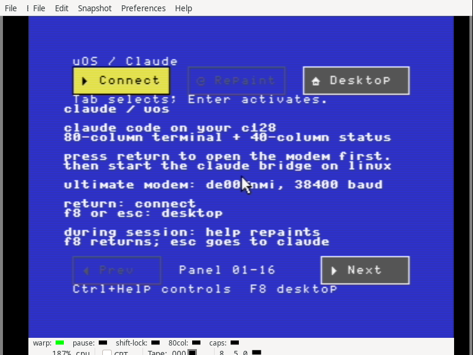
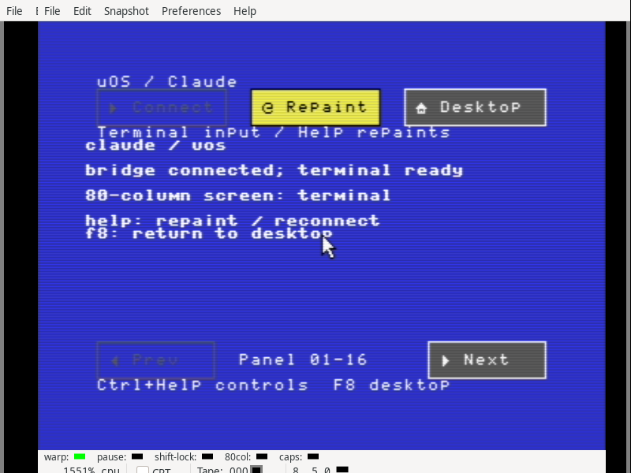
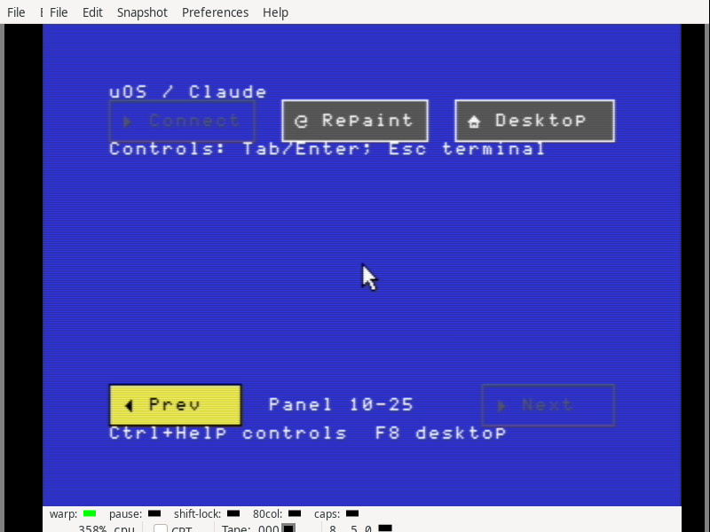

# Claude graphical companion — software checkpoint

Claude now has the suite's blue VIC frame, yellow focus, icon buttons and 1351
mouse controls. Connect, Repaint, Desktop and two status pages accompany the
full 80×25 VDC terminal. Ctrl+Help selects local keyboard controls; ordinary
terminal keys retain their host meanings. This completes blue VIC frames for
the six current suite apps, following signed base commit
`2f24a31bc7f04d4582d92fd7e0bf9e3750ec9749`.

## Evidence

* 502 frozen inputs reproduce all 24 native PRG/D64 images in separate frozen
  and main-tree builds. Only Claude and its two containing disks change; the
  other app images, diagnostic images and resident kernel retain their bytes.
* 34 CPU groups cover complete graphical surfaces, all 256 screen codes,
  live VDC glyph updates, panel colors, both status pages, keyboard and mouse
  actions, display refusal, serial errors and complete teardown. The modifier
  test checks 96 combinations through the owned KEYCHK callback.
* A paced 38,400-baud stream delivers 3,228 bytes with a peak receive queue of
  192 bytes and no drops or overruns. It interrupts bitmap transfers 181 times,
  including the actual `$3f` RAM-store mapping. The complete terminal and panel
  agree with their expected bytes afterward.
* 39 host cases cover the bridge and its protocol. These use deterministic
  fixtures; they do not contact an AI service.
* All 13 qualified processes reach terminal exit zero. Five VICE workflows
  cover complete suite mouse sessions from 40- and 80-column cold boots,
  keyboard navigation, and two serial sessions using the TCP/PTY bridge.
  Real ROM Ctrl+Help enters local controls; mouse clicks add no keyboard events.
  Mouse Desktop receives the shutdown acknowledgement, and host exit also
  restores the launcher.
* 180 complete palette frames check 11,520,000 VIC pixels against independent
  scene renderers, with matching raw bitmap bytes and VDC text retained.
  The two serial workflows contribute six Claude frames each.
* 1,274 CPU captures contain 4,306 bounded chunks and 5,096 before/after pairs
  for temporarily borrowed memory. All first readbacks, status guards and
  ownership checks pass. Suite workflows also compare resident code.
* Font, NMI, programmable keys, KEYCHK, display state and heap restoration pass.
  The complete suite workflows preserve every shipping disk file, copy the
  complete Editor search module, and save/reopen the 9,016-byte Paint picture
  on a separate device-9 data disk. All 426 managed pages are free on return.

## Reproduction and provenance

Run `python3 -B verify.py` from any directory. It checks the sealed file hashes,
safe archive membership, fixed images, app/module bindings, raw captures,
independent display renderers, disk contents and terminal process receipts.
`audit.json` records the result. `rebuild.py` rebuilds an extracted input tree
before sealing; `frozen-rebuild.json` and `main-rebuild.json` retain the two exact
image comparisons. Generated assembler listings contain their build paths.

`qualified-runs.json` pins each actual driver and its app/build inputs.
`preliminary.tar.gz` retains development failures and interrupted runs. These
include a CPU fixture that conflated color RAM with underlying bitmap RAM,
processor-status modeling and serial-credit fixture corrections, an observer
admission made before idle, and startup mouse movement selecting Paint before
the expected boot frame. The final serial driver enables host mouse movement
after checking the cold boot and launching Claude. It keeps exact ROM event
counts and first-readback checks.

A preliminary full 40-column mouse workflow observed zero POT values and the
correctly hidden pointer inside unchanged Ultimate code. Its failed frame and
state are retained. The complete final 40-column workflow passes the same
assertions; this transient emulator observation is not claimed as a repaired
application defect. Final emulator runs use distinct displays, each containing
only its own C128 window pair.

The client occupies 75 app pages plus its optional 36-page bitmap surface.
Its loaded image is 11,057 bytes (11,059 including the PRG load address).
Both suite disks contain twelve entries with 24 free blocks before test files.
The test's data disk leaves room for the Editor and calculator samples on the
boot disk without removing any app or reducing the copied module or picture.

This is software qualification. No physical hardware was accessed, no build
was installed, and no changes were pushed. Native physical serial qualification,
an authenticated Claude session, a VIC-only terminal, native VDC bitmap controls
and the broader OS/application roadmap remain open.
