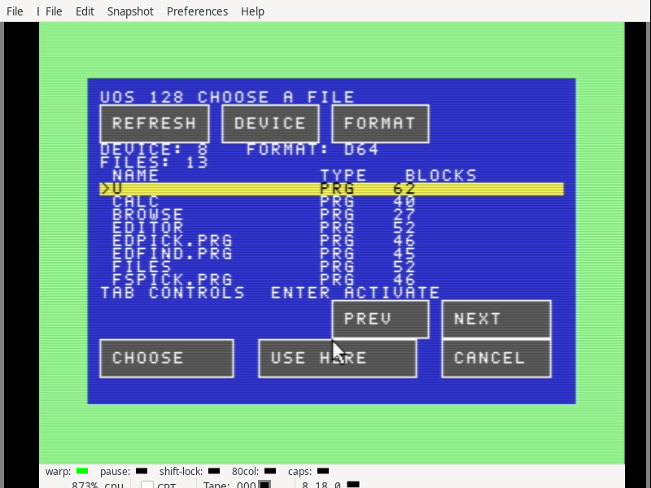

# Shared graphical picker — software checkpoint

Editor, Files, Paint and Ultimate now use the blue file picker with yellow
focus, keyboard controls and a 1351 mouse. File and directory operations keep
their existing ownership, raw paths and checked cleanup. This record follows
signed base commit `e632b33a80e6dd7a2b4d38fc95d4a988b8f45e30`.

## Evidence

* 495 frozen inputs reproduce all 24 native PRG/D64 images in
  separate frozen and main-tree builds. Ten suite images change; the diagnostic
  images and resident kernel remain byte-identical to the base.
* 52 CPU groups in 24 completed processes cover
  focus, mouse gestures, long fields, both Ultimate contexts, IEC formats,
  all four callers, full directory capacity, fallbacks and retained resources.
* Complete 40- and 80-column mouse workflows, cold-boot keyboard navigation,
  two Claude serial session lifetimes and the large-document IEC workflow pass.
  Every qualified host process reached terminal exit zero.
* 170 complete palette frames check
  10,880,000 VIC pixels, including pointer placement, against
  independent scene renderers. Matching bitmap bytes and VDC text are retained.
* 1,730 CPU captures contain 5,647 bounded chunks and 6,920
  before/after borrower pairs. All first readbacks, status guards, ownership
  tables and resident-code comparisons pass without replacement observations.
* Six documents are reconstructed from their owned RAM chunks and gap state.
  A 66,053-byte source becomes 66,057 bytes after editing; Save As, reopen,
  independent c1541 export and independent D81 sector parsing agree exactly.
* The real IEC picker retains all 296 D81 entries beside that document, visits
  the first and last pages, and uses nineteen banked cache pages. The CPU case
  checks all 37 directory pages. The 423-page peak leaves three of 426 pages free.
* The mouse workflow selects a separate device-9 data disk using Device and
  Use Here, then copies and reopens the complete Editor search module there.
  Its system D64 retains all original files and has room for the history,
  Editor and Paint sample files. Final allocation checks return all 426 pages.

## Reproduction and provenance

`verify.py` checks the sealed file hashes, archive members, fixed images,
app/module bindings, raw captures, independent display oracles, disk contents
and terminal process receipts. Run it with `python3 -B verify.py` from any
directory. `rebuild.py` rebuilds a supplied extracted input tree before sealing;
`frozen-rebuild.json` and `main-rebuild.json` contain the two exact comparisons.

`qualified-runs.json` pins each actual driver and its inputs. `preliminary.tar.gz`
retains failed and interrupted development runs, including an outdated Paint
focus sequence, a CPU-view bank poll, short host key presses, mouse settling,
the insufficient single-disk fixture and a concurrent X display allocation
collision. These runs are not qualification passes. The corrected drivers keep
exact ROM event counts and first-readback assertions; app binaries stayed fixed
through the final checks. Final emulator displays are distinct and each contains
only its own C128 window pair.

The Editor core and picker total 24,574 bytes in a 24,576-byte module window;
the build still rejects overflow. Paint uses 96 app pages and Ultimate uses 89.
The suite D64 contains twelve entries with 48 free blocks before test files.

This is software qualification. No physical hardware was accessed, no build
was installed, and no changes were pushed. Native physical qualification,
Claude's graphical frame, VDC bitmap presentation and the wider application
roadmap remain open.
