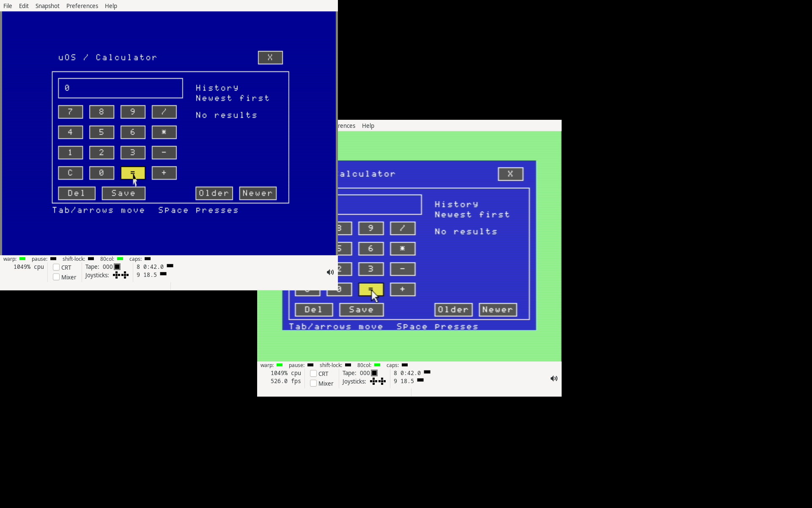

# Graphical VDC Calculator and packed native boot

Software qualification, 2026-09-13. Base: signed commit
`d023218dd76fe166d2359bba1b3b62f32071ec87`.

Calculator now presents its blue keypad, history and save dialog on both the
VIC and VDC. A 64 KiB VDC uses yellow focus; a 16 KiB VDC uses a bright reverse
selection. The shared VDC lifetime and pointer code preserve the previous
display. The incremental presenter reads the owned VIC surface and updates
changed eight-line rows. A digit/focus update in the checked fixture writes
3,840 VDC bytes in mono or 4,320 with attributes; pointer-only movement writes
at most 96 bytes. Unchanged history is not repainted.

A display stall retains its snapshot and blocks handoff until restoration can
be retried. Fatal history errors preserve their original exit code, accept
Escape for recovery and do not accumulate abandoned stack frames. A refused
display leaves the existing VIC/text fallback usable. Register 23's inclusive
last-raster value is checked before changing VDC configuration.

The additional app code fits the complete D64 suite through a compressed
kernel boot file. Disk `U` contains a bounded RLE decoder and CRC16 check;
the exact uncompressed kernel remains available as `uos128.prg`. The decoder
uses the future low-kernel and app regions only during startup. Four raw
kernel profiles, the ABI, resident RAM budget and the other five apps/modules
retain their bytes. All twelve shipping files remain on both suite formats.
D64 has 11 free blocks and D81 has 2,507.

## Result

| Evidence | Passed |
|---|---:|
| Frozen inputs | 567 |
| Native PRG/D64/D81 images reproduced by two clean builds | 33 |
| CPU cases/groups | 69 |
| Complete VIC palette frames | 137 |
| Complete VDC palette frames | 45 |
| Compared palette pixels | 14,528,000 |
| VDC snapshots restored before handoff | 14 |
| CPU captures / chunks | 1,622 / 5,746 |
| Exact observer borrower checks | 6,488 |
| Successful supervised jobs | 11 |

The CPU cases cover both physical VDC capacities in both incoming address
arrangements; arithmetic, pointer edges, focus, history, verified save and
cancel; allocation refusal; failed row upload; partial register restoration;
fatal history recovery; and interruption during the alias probe and first
bitmap write in both Desktop and Calculator. Twenty boot cases execute all
four wrappers, preserve D/I and MMU state, constrain writes to startup regions,
and reject payload damage, truncation, early termination, output overflow and
C64 mode before entering the kernel.

Two complete VICE workflows cold-boot the shipped media with a private X
display and real host keyboard/1351 input:

- D64, emulated 1541, initial 40-column console and 16 KiB VDC.
- D81, emulated 1581, initial 80-column console and 64 KiB VDC.

Each workflow opens all six apps, verifies Calculator history and Editor
documents, copies a complete module through Files, exercises Ultimate and
Claude controls, and saves/reopens Paint. Every shipped file remains unchanged.
All 426 managed pages and 32 handles are free at the final workspace; resident
kernel captures match the raw images before and after the workflow. The
fourteen handoff checks include Calculator's own VDC snapshot before the
desktop is reloaded.



[16 KiB VDC view](calculator-16k.png).

## Recheck

```sh
python3 docs/validation/2026-09-13-native-vdc-calculator/verify.py
```

The offline verifier checks the archive manifests, exact media contents,
rebuild results, source versions used by each successful job, raw capture
chunks, borrower restoration, complete rendered frames, app snapshots,
document bytes, resident regions and final ownership tables. `audit.json`
contains its result. `SHA256SUMS` seals the record; sealed files must not be
edited. The source and image inputs are in `inputs.tar.gz`.

Preliminary logs retain development failures and an obsolete interrupted run.
One recovery child produced a passing report, but its supervisor ended with
tool exit 143 before recording completion; the cause is unknown. That run is
excluded from qualification. The separately supervised recovery rerun passed
and is included in `jobs.json`. Earlier prototype logs are development history;
the qualified jobs use the archived frozen inputs and explicit source overlays.

No physical hardware I/O, deployment or remote push occurred. VDC graphics in
Editor, Files, Paint, Ultimate, Claude and the picker still require code-space
and backing-store work. Physical C128/expansion qualification and the wider
[OS roadmap](../../IMPLEMENTATION-ROADMAP.md) remain open.
