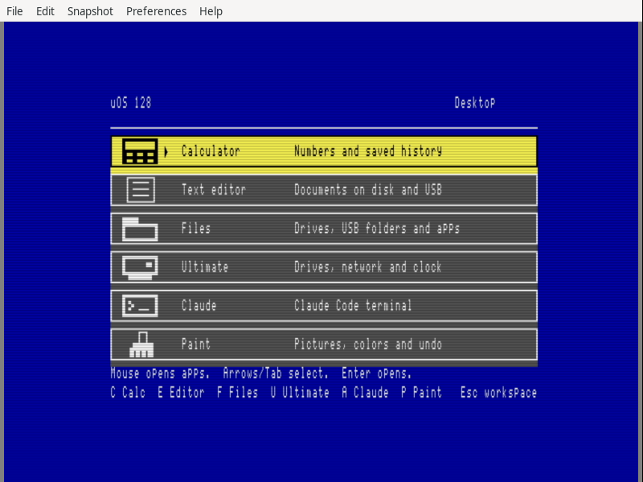
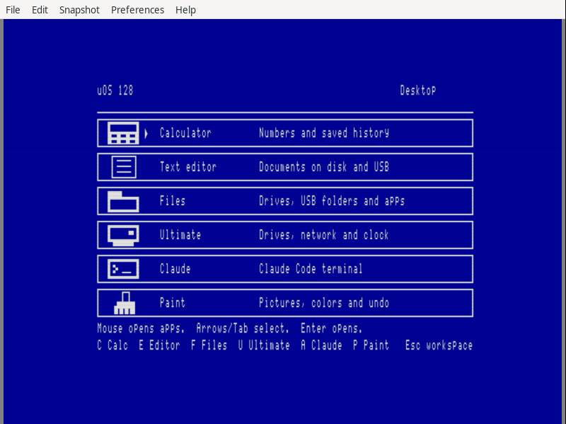

# Native VDC graphical desktop — software checkpoint

The uOS launcher now presents its blue desktop, six app icons and shared mouse
selection on both displays: 320×200 VIC and 640×200 VDC. A 64 KiB VDC displays
yellow selected cards and gray remaining cards. A 16 KiB VDC uses white graphics
on blue with an arrow beside the selected app. Native VDC text inside the apps
remains available while their graphical migration continues.

This checkpoint follows signed base commit
`5975914bead1ccd09e4d7da90255702a991f2838`. It retains an app-local foreground
VDC driver, a reversible RAM-capacity probe, compressed scene rendering and
owned snapshots restored before every app or workspace handoff.

## Evidence

* 531 frozen inputs reproduce all 24 native PRG/D64 images. Separate frozen
  and main-tree builds retain exact image comparisons. Only `desktop.prg`
  and its two containing disks change; resident code and all other app images
  preserve their bytes.
* 39 CPU groups cover both physical VDC capacities with both initial address
  arrangements, all six app launches, keyboard selection, pointer clipping,
  allocation refusal and exact memory/register restoration. They include
  recovery after stalls during the alias probe, the first bitmap write,
  pointer drawing and a close that has partly restored the address register.
  A failed restore retains the snapshot and blocks handoff until a retry
  completes. The existing pointer tests retain all 16,384 counter pairs.
* Seven VICE workflows reach terminal exit zero. Two complete mouse sessions
  launch and return from all six apps, starting in 40-column/16 KiB and
  80-column/64 KiB configurations. Two keyboard sessions run with the VDC as
  the initial console, one per RAM capacity, and check workspace and occupied
  surface fallback paths. Two serial sessions retain real ROM Ctrl+Help,
  host output and both Claude shutdown paths. One additional 64 KiB/
  40-column workflow checks the boot frame only.
* 286 complete palette frames compare 22,976,000 pixels: 213 VIC frames and
  73 VDC frames. The VDC checks link the complete 16,000-byte bitmap and, when
  enabled, all 2,000 attributes to CPU capture chunks and independent scenes.
  The two screenshots here come from qualified keyboard workflows.
* Twelve stopped-CPU observations check the entire 16,384- or 18,432-byte VDC
  snapshot after memory restoration and before register restoration, while
  the desktop still owns it. These cover all six handoffs in both full mouse
  sessions. Claude's original font is reconstructed from the desktop snapshot
  and untouched RAM, then compared after the terminal returns.
* 2,085 CPU captures retain 7,462 bounded chunks and 8,340 before/after pairs
  for borrowed memory. Every first readback and restoration check passes.
  Full suite and keyboard workflows also compare resident code.
* The workflows preserve all shipping disk files, save the calculator history
  and Editor sample, copy the complete Editor search module, and save/reopen
  a 9,016-byte Paint picture on device 9. Programmable keys, KEYCHK, sprites,
  font/NMI state and all 426 managed heap pages are restored.

Eleven supervised test processes have terminal receipts. The six fault CPU
cases are a separately identified terminal exit-zero observation from tool
session 4566; they are included in the 39 CPU groups. This distinction is
retained in `manual-terminal-observations.json` rather than represented as a
supervisor receipt. No authenticated AI requests were made.

## Reproduction and retained failures

Run `python3 -B verify.py` from any directory. It verifies sealed file hashes,
safe archive members, fixed images, app/module bindings, raw capture chunks,
independent display scenes, pre-handoff snapshots, disk contents and process
receipts. `audit.json` records the result. `rebuild.py` recorded separate
frozen and main-tree builds before sealing. Assembler listings contain their
build paths; reproducibility compares all PRG/D64 bytes.

`qualified-runs.json` pins actual drivers and build inputs. `run-sources`
retains two earlier helper versions by hash. The dedicated VDC model overrides
both ports; its first final core/launch runs used the earlier generic VIC bus.
The generic bus was subsequently taught to expose an absent VDC for legacy
pointer tests. The earlier mouse workflow source has less failure diagnostics;
its input gestures, assertions and deadlines are unchanged. Two unrelated
emulator test files were being edited during the first CPU/mouse runs; those
programs are explicitly identified as unexercised in those runs.

`preliminary` retains the initial model runs and development failures. An
undersized private X screen kept mouse motion against the VDC window edge;
the mouse workflows now use 1920×1200 screens. An initial canvas request used
an unsupported format; the corrected request follows the official monitor
protocol. A generic VIC-only CPU fixture initially rejected the new VDC port
probe; its absent-chip behavior now permits the existing pointer suite.

The first full 64 KiB mouse session timed out after Files had loaded and begun
reading its directory. Its exact VDC snapshot restoration had already passed.
The failure, screenshot and disk are retained. A complete retry passes with
unchanged app images, assertions and timeout, and additional failure capture
of CPU registers, stack, mailboxes and app RAM. The original timeout's cause
remains unclassified; this record does not claim an application fix for it.

`reference` retains eight VICE source files pinned at
`86fb219f3214bf0dcbb74dc965bde4116109d388`, including the VDC address mapping,
bitmap renderer and 23-byte monitor checkpoint response. The
[driver notes](../../NATIVE-VDC-DESKTOP.md) link the Commodore references and
explain register and snapshot ownership.

## Scope and remaining work

The launcher uses 43 app pages, 36 VIC surface pages and a 64- or 72-page VDC
snapshot, leaving 283 or 275 free managed pages while open. It contains
10,885 loaded bytes. Both suite disks retain twelve shipping entries with
eight free blocks before user documents; device 9 supplies the larger test
outputs without shrinking the module copy or Paint picture.

These workflows qualify the normal ROM 80×25, eight-line VDC text geometry.
Monitor timing is retained. Custom configurations, including a shorter
character display height in register 23, are not normalized or qualified by
this driver. Additional geometry checks and mode support remain future work.

This is software qualification. No physical machine was accessed or updated,
and no changes were pushed. Physical native suite/VDC testing, shared VDC
presentation inside all apps, independent monitor focus, extended desktop
roles, app switching and the broader OS roadmap remain open. The large Editor
and D81 picker workload already occupies 423 of 426 pages; its capacity must
be preserved while designing shared VDC lifetime and backing storage.
