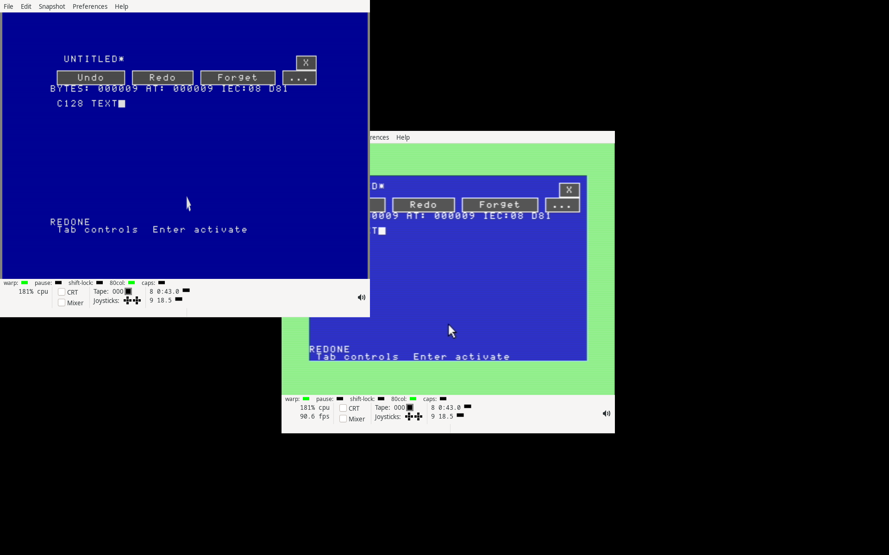

# Native Editor history qualification — 2026-09-14

All 45 selected CPU suites and both private VICE cold boots passed.
The independent clean rebuild reproduces all 35 program/disk images.

This checkpoint adds sixteen-step Undo/Redo to the blue native Editor. It
builds on signed revision `11d64e288cb1d62e2e8957d871559e4cf885d202` and the
immutable [shared clipboard record](../2026-09-14-native-shared-clipboard/README.md).
The [history guide](../../NATIVE-HISTORY.md) describes the controls, component
interface, memory limits and failure behavior. This is software qualification;
physical deployment remains pending.

Ctrl-Z / Undo and Ctrl-Y / Redo replay typed edits, backspace, selected spans,
Cut/Paste and literal replacements. The fifth `...` toolbar page retains its
selection across module swaps and provides Undo, Redo and Forget (Ctrl-U).
A verified Save As marks the clean history position; New and successful Open
start a new history. The session clipboard keeps its separate lifetime.

The shared banked provider stores before/after spans, with 24-bit positions,
in native RAM or an available REU. It preserves failed-free tokens, stages
records before publication, trims redo branches and evicts the oldest of
sixteen steps. A successful edit that cannot be recorded clears stale history
and reports that undo is unavailable. RAM-only VIC documents may reclaim
optional history and its provider before refusing growth. An uncertain
transfer poisons the document and prevents Save As from reporting success.

## Executed checks

Frozen execution manifests, commands, process identities, exit codes, logs
and reports are preserved in `executions.json`, `jobs.json` and `jobs.tar.gz`.
Selected qualification consists of 45 CPU suites and two private VICE cold
boots. Earlier failed development or fixture runs remain in
`development.tar.gz`; they are not counted as successful qualification.

The CPU workflows cover saved positions, branching, eviction, aborted records,
allocation/free/transfer failures, retry and dirty-baseline recovery. Actual
Editor tests exercise keys, mouse controls, both VDC sizes, RAM memory pressure,
selection, binary bytes and CR/LF forms, clipboard exchange with Claude,
literal replacement, New/Open/verified Save As, and a 131,118-byte REU document.
The direct provider checks include a removed span of 131,119 bytes and DMA
faults. The existing document oracle also rechecks five document states.

Regression suites exercise the shared VDC/REU provider with Calculator, Paint,
Files, Ultimate and Claude, retained display/source failures, document transfer
refusal, and the original ROM keyboard-matrix filter in all seven app images.
The enlarged provider has a 9,906-byte payload in 39 bank-1 pages. The resident
kernel, 426-page heap, diagnostic app images and the other six packed suite
images retain their parent bytes.

VICE boots D64 with 16 KiB VDC/main-RAM backing and D81 with 64 KiB VDC/512 KiB
REU backing. Both workflows use actual ROM modifier keys and 1351 mouse input,
return from Undo/Redo to ordinary selection/file operations, and verify exact
saved files and restored graphics/heap ownership. The REU workflow also edits,
saves and reopens the 131,118-byte document. An independent offline model
reconstructs thirteen complete document/history REU snapshots from expected
edits and validated allocation tokens, including unused and freed bytes.

A clean independent rebuild reproduces all 35 PRG/D64/D81 images. The standalone
audit decodes packed applications, validates module bindings and CRCs, checks
every disk file/chain/BAM bit, compares complete VIC/VDC palette canvases,
checks capture borrower restoration, and verifies saved documents and REU bytes.
The final totals are recorded in `audit.json`. CPU qualification contains
120 reported test groups plus five legacy document-oracle states. The audit
checks 118 canvases containing 11,328,000 pixels, 1,375 restored CPU captures
and all thirteen complete document/history REU snapshots. Both emulator exits
restore all 426 managed heap pages.

The suite leaves 96 D64 blocks or 2,592 D81 blocks free. Editor retains its
96-page application and 16-page workspace. Its three modules start at `$9770`;
the largest ends at `$bff5`, leaving 11 bytes before the VIC surface.

## Reproduction and seal

Run the standard-library verifier without network, VICE or a C128:

```sh
python3 -B verify.py
```

`SHA256SUMS` seals every top-level record file. Each archive has a separate
member-size/hash manifest. `inputs.tar.gz` is the final source/build/test
snapshot; `execution-blobs.tar.gz` stores other executed input versions by
SHA256. Reconstruct each execution using its manifest and either the matching
final input or the named blob. Runtime inputs match across all selected runs.
The original system ROM hash is recorded without redistributing the ROM.

`outputs.tar.gz` retains emulator captures and private disk/REU images.
`rebuilt-images.tar.gz` stores the independent rebuild. Parent images and
changed parent files have their own archives; `changes.json` describes the
integration delta. CPU tests use py65; the loaded Claude handoff also uses pyte.
The exact interpreter and PYTHONPATH are in the job records. The private VICE
processes and X servers must be terminal before archival.

Development corrected an anonymous allocation-retry branch and moved the
selected toolbar page into retained workspace so overlay reloads preserve it.
Fixture corrections distinguish N_IOERROR (17) from N_PLATFORM (8), avoid
sending Escape when a failed Save As has already closed its field, retain the
Redone status when changing toolbar pages, and check the undo warning after
memory reclamation. The older RAM large-file fixture exceeded the pre-existing
GUI capacity on the signed parent too; it now checks an exact 65,536-byte saved
result, while REU workflows cover larger files. Desktop startup has the same
16-million-instruction fixture limit as the graphical Calculator, allowing the
larger checked provider to load. A later D64 run reached the Find button's
accepted two-pixel target range, but repeatedly missed a second input-ready
sample while VDC drawing resumed. The helper already waits for readiness and
checks a stable position; removing that redundant second sample retains those
checks, button arming/release, input-event counts and full frame assertions.
The failed route and subsequent cold-boot retry are preserved. These fixture
changes are recorded separately from runtime fixes.

Undo is volatile and records individual keystrokes and replaced matches.
Grouping, session recovery, broader app undo and physical qualification remain
roadmap work.


