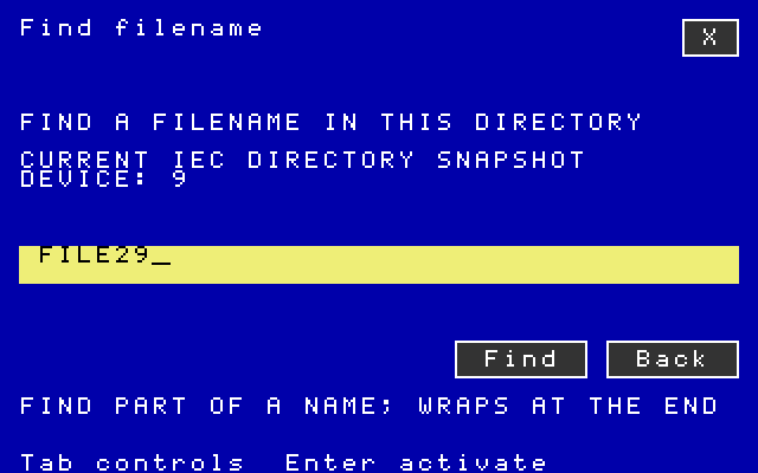

# Native filename search — software checkpoint

Files adds **Find / Ctrl-F** on the blue VIC and VDC interface. Enter part
of a filename to select the next matching row, wrapping at the end. IEC
uses its full directory snapshot; Ultimate streams complete names through
an owned cursor and publishes a complete match page. Cancelled, failed and
absent searches preserve the old page and selection.

This checkpoint is based on signed local parent `ed6fa73096ef538465bd0201d9c0a52beb609cce`. It has
not been pushed or installed on the physical C128/Ultimate.

## Qualification

- 19 CPU suites, 153 reported cases/groups, all with observed exit 0.
- The assembled matcher passes 49,822 independent byte-string comparisons.
- Directory workflows cover 296 IEC entries, 521 Ultimate entries, complete
  255-byte names, both DOS contexts, keyboard and mouse input, absent matches,
  malformed replies, foreign transactions, cancellation and retained recovery.
- Two private VICE boots exercise Find, a match beyond the visible page, wrap,
  absent-match preservation, Files copy, the picker and Editor/Paint handoffs.
- An independent build first removed all 36 native output images, then
  reproduced each PRG/D64/D81 byte for byte.
- The standalone audit checks 74 modal canvases,
  126 VICE canvases and 963
  restored CPU captures, along with disk chains/BAM bits and module CRC bindings.
- Files retains 96 app pages and the kernel keeps all 426 managed pages.
  Fifteen suite entries leave 81 D64 blocks or 2,577 D81 blocks free.

Ultimate directory operations use an independent FIFO/filesystem model.
VICE qualifies the native application, real IEC disk workflows and both
visible displays; it does not emulate a physical Ultimate cartridge.
Physical qualification, sorting, recursive search, persistent filters,
shared-picker search and the wider completion roadmap remain open.

## Reproduction and contents

Run `python3 -B verify.py` here for the offline archive, image, disk and pixel
audit. Unpack `inputs.tar.gz` into an empty directory and run
`python3 -B build-native-desktop.py` with 64tass, cc65, c1541 and a C compiler.
`statuses.json` retains exact test commands. CPU tests require Py65; VICE
tests require x128, Xvfb, ImageMagick and the repository harness's C128 ROMs.
Use fresh report filenames so existing capture directories stay intact.

`executions.json` records every executed input version; changed test/document
versions are retained by hash in `execution-variants.tar.gz`. All program/build
inputs match the qualified images. `jobs.tar.gz` contains reports, logs and
modal frames. `vice.tar.gz` retains private disks, screenshots and CPU/canvas
captures. `references.tar.gz` pins relevant Ultimate firmware source.
Development failures and corrected test fixtures are recorded separately.
