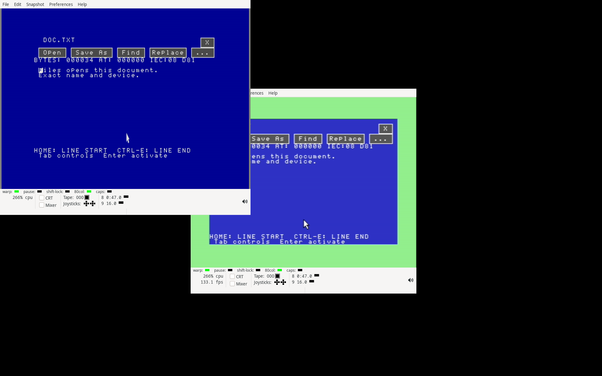

# Native document launch qualification — 2026-09-14

All 34 selected CPU suites (469 reported cases/groups) and both
private VICE cold boots passed. All 36 program/disk images reproduce exactly.

This checkpoint connects the blue Files app to Editor and Paint. Edit/Ctrl-E
and Paint/Ctrl-P choose an app explicitly; Open recognizes UPNT pictures and
ASCII .TXT/.SEQ names. Closing the app returns to the selected document.
Other files remain available through the byte viewer, and View always inspects
bytes. The [document launch guide](../../NATIVE-DOCUMENT-LAUNCH.md) describes
the controls, request contract, cleanup and current limits.

The base is signed revision `34bc252174145e974577df7c473d36e7d0169ede` and its
immutable [Editor history record](../2026-09-14-native-editor-history/README.md).
The native ABI advances to 1.14. `FSOPEN.PRG` uses the existing Files module
window; Editor receives documents through `EDCLIP.PRG`, and Paint uses its
existing staged picture loader. App executables stay on the boot volume while
document identity retains its device, geometry, IEC type and full Ultimate path.

## Executed checks

Selected qualification comprises 34 CPU suites and two private VICE cold
boots. Execution input manifests, commands, process identities, exit codes,
logs and reports are retained in `executions.json`, `jobs.json` and
`jobs.tar.gz`. Earlier failed, cancelled or superseded runs remain in
`development.tar.gz` and are excluded from these totals.

The CPU tests execute the actual dispatcher, packed app loader, module gates,
file services and resource cleanup on one machine across each handoff.
They cover all three IEC geometries, both Ultimate DOS contexts, a 255-byte
path, mouse and keyboard requests, UPNT signature precedence, exact text and
picture bytes, Undo, a two-page binary preview, missing apps/documents,
mismatched requests, stale request expiry and an ordinary blank Editor launch.
A reordered directory must restore the selected raw name at its new row;
a vanished document returns to a clamped selection. Dedicated startup cases
check both VDC sizes with main RAM, plus a 64 KiB VDC with a 512 KiB REU.

The returning request helper has 52 valid/malformed-input cases. The compact
font checks execute all 95 printable glyphs from each of Editor, Files and
Paint and compare all eight original row bytes. The kernel's compact workspace
pattern routine is checked against independent complete 8 KiB patterns and
seven corrupt offsets in each bank. Regression suites cover app/module loader
failures, relocation, immutable running code, packed startup, original-ROM
keyboard filtering in all seven apps, Editor search/pickers/REU history,
Files copy/pickers/recovery, Paint files/pickers/display recovery, desktop,
clipboard exchange, file streams and the Ultimate loader.

VICE boots D64 with 16 KiB VDC and D81 with 64 KiB VDC; both use main-RAM
screen backing. Each private disk contains deterministic text and UPNT
fixtures. The workflows exercise desktop selection, a verified Files copy
through the shared picker to another private disk, mouse Edit/Paint buttons,
full document views, return to each selected file, and the desktop/workspace
exit. Actual ROM keys and a 1351 mouse drive the apps. Both emulator workflows
must preserve every original disk file and the document fixtures, restore
borrowed CPU/VDC state, and release all 426 managed heap pages.

A separate clean build reproduces all 36 PRG/D64/D81 images. The standalone
audit decodes every packed app, checks all six app-bound module checksums and
bounds, verifies every disk file/chain/BAM bit on all six release disks,
compares complete VIC/VDC palette canvases and validates capture restoration.
The audit checked 102 canvases containing 9,792,000 pixels and
801 restored CPU captures. `audit.json` records the complete totals.

The suite retains 93 free D64 blocks and 2,589 free D81 blocks. The unchanged
VDC provider occupies 39 bank-1 pages. Editor and Files retain their 96-page
app allocations. Editor's module window begins at `$9792`; its largest module
ends at `$bf81`, leaving 127 bytes. Files' window begins at `$9813` and its
picker ends exactly at `$c000`. `FSOPEN.PRG` has a 340-byte payload.

## Development findings

Development caught old direct row-font reads in Editor's fast renderer and
Paint's shared picker; both now use the common lossless decoder. Association
signature constants were moved into the resident Files core so byte previews
can classify a file before loading `FSOPEN.PRG`. A redundant initial-open flag
clear was removed to keep Files' picker inside its checked window.

The first full VICE handoff exposed a startup-order bug: Editor retained its
history provider before the VDC could acquire it on a machine without an REU.
The incoming-document path now initializes the display before selecting
storage, matching ordinary startup. All three dedicated VDC/REU startup cases
and the repeated complete disk boots use that correction.

The Ultimate loader fixture still rejected minor 13 after the earlier ABI
advance. It now explicitly accepts sealed ABI 1.13 and 1.14 images and rejects
minor 15 before checksum processing, matching the IEC loader regression.

Fixture corrections give the complete workspace pattern enough CPU steps and
require the byte viewer's exact input/status channels while paging; all other
idle app states still require no open file. The final directory-change checks
strengthen the name-restoration and missing-document assertions. Superseded
execution manifests and differing input bytes are retained; cancelled runs
are recorded separately and are never reported as successful qualification.
A D64 return reached Files and was loading `FSVIEW.PRG` when the generic
two-minute key wait expired. Document returns now use the same bounded Files
loading wait as initial launch: ten minutes total, with a two-minute limit
without file/list progress. Keyboard event counts and all final assertions
remain required. The failed return and repeated complete D64 boot are retained.
One complete D81 workflow reported success and terminal emulator/X processes,
but its supervisor ended with status 143 before recording the child exit code.
Its report and all captures are retained as excluded evidence; final selection
uses a repeated D81 workflow with a recorded child exit status.

## Reproduction and seal

Run the standard-library verifier without network, VICE or a C128:

```sh
python3 -B verify.py
```

`SHA256SUMS` seals every top-level file. Each archive has a separate member
size/hash manifest. `inputs.tar.gz` holds the final source/build/test snapshot;
`execution-blobs.tar.gz` supplies other executed input versions by SHA256.
Reconstruct an execution using its manifest and either the matching final
input or the named blob. Production runtime inputs match all selected runs.
Generated Claude intermediates, Python caches, old validation records and the
four protected untracked files are outside the input snapshot.

`outputs.tar.gz` retains the private emulator captures and disks.
`rebuilt-images.tar.gz`, `parent-images.tar.gz` and `parent-changes.tar.gz`
retain the independent rebuild and integration baseline; `changes.json`
records the complete applied delta. Tool versions and the original ROM hash
are recorded without redistributing the ROM. All private emulators and X
servers are terminal before archival. The 57 prior seals and four protected
untracked files remain unchanged.

This is software qualification. User-configurable associations, more document
types, multi-document windows and physical deployment remain roadmap work.


