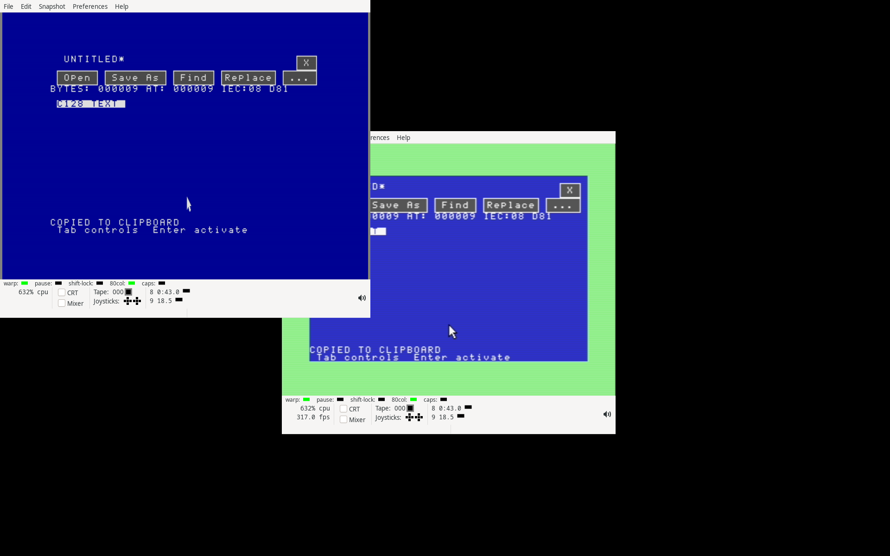

# Native shared text clipboard qualification — 2026-09-14

This checkpoint adds a 15 KiB session clipboard to the native Editor and
Claude apps. It builds on signed revision
`e66ac82ca47b05a9238832caec893e775baed892` and the immutable
[Editor selection record](../2026-09-14-native-editor-selection/README.md).
No physical C128, cartridge, USB volume or external Claude account is used.
This record describes software qualification; physical deployment remains pending.

Editor supports selection Copy/Cut, Paste that replaces a range, and Clear.
Claude copies its full retained 80×25 screen to ASCII and negotiates framed,
acknowledged bracketed paste with the matching bridge. Published clipboard
memory survives app cleanup. Incomplete copies retain the old item, and a
failed document transfer prevents a successful Save As. The
[clipboard guide](../../NATIVE-CLIPBOARD.md) defines limits and controls.

## Executed checks

Qualification uses frozen execution trees. `executions.json` records every
input hash for each tree. `jobs.json` and `jobs.tar.gz` retain commands, process
IDs, environment additions, start/end times, exit codes and complete reports.
Every selected job completed successfully. Development and superseded observer
runs are preserved separately and are not counted as passing qualification.

* 34 loaded-CPU/host suites cover the clipboard library, full 15 KiB copies,
  30 KiB Editor results, partial-capacity refusal and retry, exact saved bytes,
  mouse controls, missing-module refusal, uncertain-read poisoning and Clear.
  One kernel instance executes Editor → Claude → Editor, checks negotiated
  paste against the actual host parser, then saves the copied terminal rows.
* Native paste checks cover old/unsupported bridges, cancellation, changed
  publication identity and explicit host rejection. Host tests split every
  packet boundary and validate a 16 KiB protocol item, key ordering, newline
  conversion, invalid bytes/counts, incomplete payloads, BYE and credits.
* ABI 1.13 app/module acceptance, heap ownership, Editor selection/search/
  picker/source regressions, Claude terminal/NMI behavior and both VDC sizes
  remain covered. Original-font read/free failures retain the token and retry;
  display/source-close/REU failures retain their owned resources.
* Two private VICE cold boots exercise ROM modifier keys and real 1351 mouse
  input on D64/16 KiB VDC/RAM and D81/64 KiB VDC/512 KiB REU. Complete VIC/VDC
  canvases, clipboard metadata/heap payload, saved files, font/display restores
  and final heap descriptors are captured. The REU run also edits, saves and
  reopens a 131,118-byte document and compares every unrelated REU byte.
* A separate clean build reproduces all 35 program and disk images byte for
  byte. The standalone audit checks packed manifests/CRCs, all three Editor
  module bindings, every disk file/chain/BAM bit, saved files, full display
  pixels, capture borrower restoration and complete REU snapshots.

`audit.json` verifies 270 reported CPU/host groups plus 779 heap API calls,
94 canvases containing 9,024,000 pixels, 980 restored CPU captures and nine
complete REU document snapshots. All 426 heap pages are available again after
Clear and app exit in both emulator workflows.
The suite leaves 103 D64 blocks or 2,599 D81 blocks free. Editor still owns a
96-page app and its renderer ends at `$bfe8`; its three modules share one
window beginning at `$96f3`. Claude owns 96 app pages and a separate 16-page
original-font allocation.

## Reproduction and seal

Run the standard-library verifier without network, VICE or a C128:

```sh
python3 -B verify.py
```

`SHA256SUMS` seals every top-level record file. `inputs.tar.gz` contains the
final build/source/test snapshot; `execution-blobs.tar.gz` contains only input
versions that differ from that snapshot, keyed by their SHA256. Each archive
has a separate member-size/hash manifest. Reconstruct a job's tree by its
manifest, using the matching final input or the named content blob. The
original ROM hash is recorded, but the system ROM is not redistributed.
The CPU tests require py65; the bridge tests also require pyte. Job records
retain which interpreter and PYTHONPATH were used.

`outputs.tar.gz` preserves raw emulator captures, private disk images and REU
snapshots. `rebuilt-images.tar.gz` preserves the independent rebuild;
`parent-images.tar.gz` and `parent-changes.tar.gz` preserve the preceding bytes.
`changes.json` records the precise integration delta. `development.tar.gz`
preserves the work log, including earlier implementation and observer failures.

The observer corrections include unwrapping the nested terminal bus when
checking VIC restoration, addressing the native C symbol by its emitted name,
completing the Save As field before checking failure cleanup, and observing
the ROM-fed key counter before releasing a shortcut. The private VICE X
display also disables host autorepeat so a host key hold during module I/O
cannot inject repeated press/release events. The C128 repeat flag is saved,
disabled for the input fixture and restored on completion. Runtime bytes
match across every selected execution tree. The 128 KiB open/save/reopen
operations have a 600-second host deadline and less frequent monitor polling;
this changes the fixture’s wall-clock allowance, not native file behavior.

Original-font cleanup was corrected during development: completed restoration
advances its phase before later release retries, and native programmable keys
remain installed until retained allocations close. The final font-failure
checks execute both refused-read and refused-free recovery paths.



The final paste timeout subtracts elapsed jiffy ticks, including ticks skipped
while drawing. A native skipped-tick test covers expiration; all earlier
runtime qualification was superseded after this correction.

The final VICE fixture uses Xvfb’s atomic display allocation instead of a
free-display scan, checks that the display accepts connections, and records
the private server PID and completed shutdown. Failed startup and shared-X
display attempts are retained as superseded observer runs.

The final input correction rechecks every decoded key against the keyboard
matrix. A captured D64 Copy failure queued a period from ROM `$c6be` with
index 82, modifiers 4 and CIA columns `$f7`. Explicit nested calls to the
original ROM scanner reproduce that state, plus keypad 5 and minus. The
former filter checked only mouse-related rows and accepted these false keys.
The corrected filter rejects stale candidates on every row, with A/X/Y/P
and CIA configuration preserved for accepted keys. The matrix suite covers
all seven app images, both mappings, every key with plain/Shift/Control
input and all 11 nested scan positions. Earlier passing runs are superseded
because their runtime does not contain this correction. Atomic X allocation
and disabled host autorepeat address separate fixture issues; neither was
the cause or fix for the false keypad characters.

A later app-return observer failure read `$9999` as the key count while the
CPU was inside the ROM far-store gateway. The subsequent kernel state held
the expected count 40 after event 39. Progress and admission reads now select
physical bank 0 explicitly, while I/O reads select the I/O bank. This fixture
correction does not change runtime bytes; its failed trace is retained.
