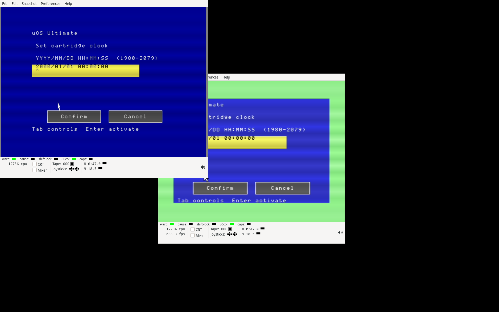

# Native Ultimate clock qualification — 2026-09-14

The Ultimate app now edits the cartridge RTC through the blue Clock page on
VIC and VDC. Keyboard and mouse entry use the shared field service, validate
1980–2079 and calendar/clock limits, and require Confirm before sending one
binary SET_TIME request. A separate GET_TIME query checks the observed value,
allowing two advancing seconds. Different and uncertain results are explicit;
Refresh cannot replay a write. See the [app guide](../../NATIVE-ULTIMATE-CONTROLS.md).

The qualification passes:

- **18 loaded-CPU jobs, 27 named cases**, including 641 calendar/field cases,
  exact keyboard-entered command bytes, leap/century/month rollovers, cancelled
  edits, ignored/rejected writes and invalid readback.
- Mouse, keyboard, complete VIC/VDC views, incremental fields and pointers,
  retained display failure recovery, existing drive/picker behavior, RAM/REU
  backing and memory pressure. Workspace conflicts, exhausted handle slots and
  a failed initialization leave foreign allocations and keyboard state intact.
- **Two VICE cold boots:** 40-column startup with a 16 KiB VDC and RAM backing;
  80-column D81 startup with a 64 KiB VDC and 128 KiB REU backing. Both use real
  ROM keyboard scans and 1351 input, exercise the clock editor's unavailable
  cartridge path, return through the blue desktop, and release all 426 managed
  pages at the final diagnostic workspace.
- **52 complete Ultimate canvases, 4,992,000 pixels**, checked independently
  against the captured surfaces and VDC presentation; all **642 CPU captures**
  restore borrowed memory. The original app VDC snapshots are checked before
  handing control back to the desktop.
- An independent build reproduces **all 34 native program/disk images**. The
  Ultimate program and four suite/workspace disks change. Resident kernels,
  the shared VDC component and every other app retain their program bytes.
  Six disk images pass directory chains, block counts, allocation maps, boot
  sectors and exact shipped-file checks. The suite has 121 free D64 blocks or
  2,617 free D81 blocks.

A single field edit writes 1,376 VDC data bytes with 16 KiB or 1,536 with 64 KiB;
the tested pointer step writes 96. The app uses 91 code pages, an initialized
11-page bank-0 workspace, a 36-page surface and the 33-page shared VDC component.
REU snapshots leave 255 managed main-RAM pages free. RAM snapshots leave 191
with a 16 KiB VDC or 183 with 64 KiB. Picker scratch/cache are temporary.

This record starts at signed commit
`331a881e86bfa3f7462b681991888b29fe57664b`. Its parent is the
[Claude display checkpoint](../2026-09-14-native-claude-displays/README.md), sealed
by `39864b5229024f1b0ce5249cacaf18325a217130b2a9ec3e4082869395ba15ed`.
The 749 final inputs and three execution generations are archived. Every
runtime input agrees across qualification runs; three differing documentation
inputs are stored by content hash. Failed/cancelled development runs are
retained as diagnostic records and excluded from qualification.

`changes.json` identifies each applied input and its before/after hashes.
Archives retain final inputs, execution differences, reports/logs, emulator
captures, rebuilt/parent images and changed parent inputs. The standalone
`verify.py` uses Python's standard library to recheck the archive manifests,
execution identities, packed app checksums, disk structures, complete canvases
and capture restoration. Run `python3 verify.py` from this directory. The
KERNAL ROM is identified by hash and is not redistributed as a ROM image.

Clock mutations here affect simulated cartridge state. Native physical RTC
writes, backup/power-cycle retention, offline system-clock fallback and distinct
system/cartridge time status remain unqualified. The app does not configure
NTP or a timezone. Broader window management, app switching and the remaining
OS/Ultimate/expansion roadmap are still open. No physical deployment occurred.
