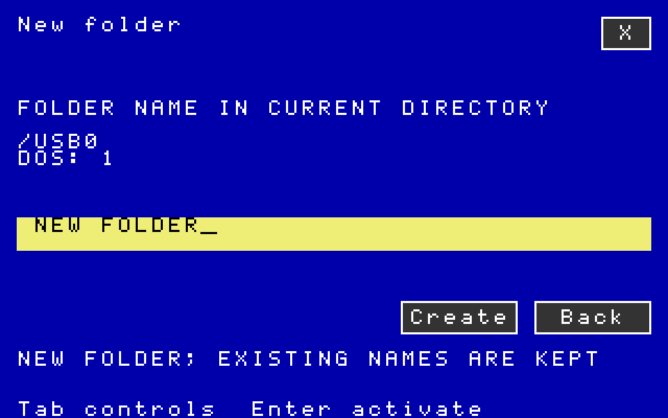

# Native Ultimate folder creation — software checkpoint

Files now creates Ultimate directories through **New dir / Ctrl-K**, using
the blue dialog on VIC and VDC, shared field editing and a 1351 mouse. The
operation preserves existing names, closes its owned directory cursor before
submission, checks the result and refreshes the parent listing on return.
Failed or uncertain requests are never replayed automatically.

This checkpoint is based on signed local parent `c2ed7ead1020f8c414aa4281477e2f52cc39566d`. It has not
been pushed or installed on the physical C128/Ultimate.

## Qualification

- 14 CPU suites, 154 reported cases/groups, all with observed exit 0.
- Two private VICE boots: D64/VIC/16 KiB VDC and D81/80-column/64 KiB VDC.
  Both retain Files copy, picker and Editor/Paint document handoffs.
- An independent clean build reproduced all 36 PRG and disk images.
- The standalone audit checked 63 folder canvases,
  102 VICE canvases, 801 restored
  CPU captures, all disk chains/BAM bits and matching module CRCs.
- Files keeps 96 app pages; the kernel retains all 426 managed pages. Suite
  disks contain fifteen entries and have 86 free D64 blocks or 2,582 free D81 blocks.

Ultimate commands are qualified against the independent FIFO/filesystem model.
VICE qualifies the shared Files interface and complete app/disk workflows;
it does not emulate a physical Ultimate cartridge. Physical folder creation,
rename/delete, IEC directories/partitions and the broader roadmap remain open.

## Reproduction and contents

Run `python3 -B verify.py` here for the offline archive, image, disk and pixel audit.
Unpack `inputs.tar.gz` into an empty directory and run `python3 -B build-native-desktop.py`
with 64tass, cc65, c1541 and a host C compiler. `statuses.json` retains exact
test commands; CPU tests also require Py65. VICE tests require x128, Xvfb,
ImageMagick and the installed C128 ROMs used by the repository's test harness.

`executions.json` identifies every executed input version. Differences from
the final input archive are retained by SHA-256 in `execution-variants.tar.gz`.
`jobs.tar.gz` contains reports, logs and folder frames; `vice.tar.gz` contains
the private disks, screenshots and capture records. `references.tar.gz` pins
the relevant Ultimate firmware source. Development failures and corrections
are separate from the successful qualification in `development-observations.json`.
